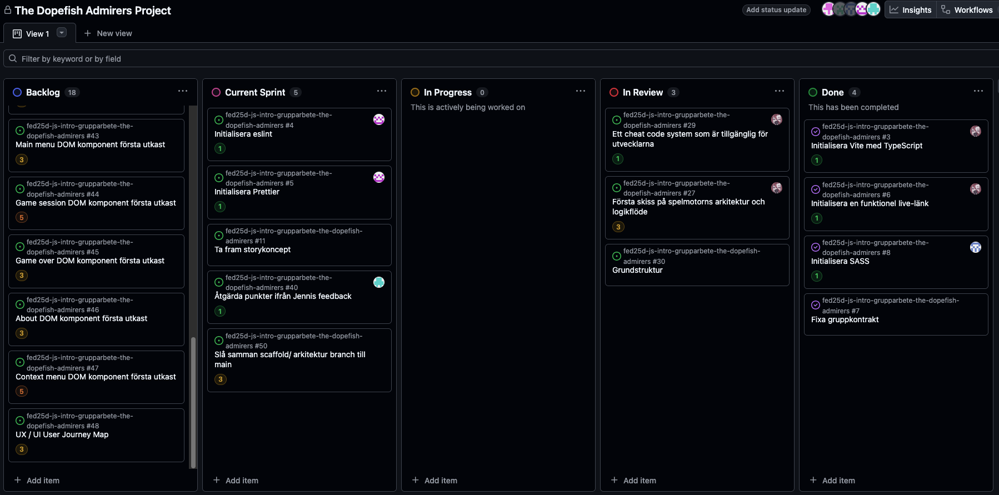

# Daily Standup: Måndag 2026-02-16

Projekttavlan vecka 2 måndag:

Dagens scrum master: Alma Isaksson.

## Alda Catovic
### Vad gjorde jag i fredags?
Organiserade i backloggen och kollade på modulerna ur kursmaterialet.

### Vad ska jag göra idag?
Har lite tankar och ideer om backloggen.

### Eventuella hinder?
Inga.

## Alma Isaksson
### Vad gjorde jag i fredags?
Jobbade på scaffolding/ grundläggande arkitektur i projektet så att vi kan komma igång.

### Vad ska jag göra idag?
Inga spontana tankar.

### Eventuella hinder?
Inga.

## Rasmus Fransson
### Vad gjorde jag i fredags?
Lämnade in budget appen och gjorde github uppgifterna ur kursmaterialet.

### Vad ska jag göra idag?
Kika på modulerna ur kursmaterialet, vill försöka komma igång med hur uppgiften ska gå till och strukutreras upp.

### Eventuella hinder?
Inga.

## Kimi Leminaho
### Vad gjorde jag i fredags?
Lämnade in budgetappen och gick igenom git-uppgifterna ut kursmaterialet.

### Vad ska jag göra idag?
Inga spontana tankar.

### Eventuella hinder?
Inga.

## Linn Boekhout
### Vad gjorde jag i fredags?
Gjorde Github-uppfigterna ur kursmaterialet, samt researchade om vad är ens ett escape room? Tänke på idéer hur det ska fungera och se ut.

### Vad ska jag göra idag?
Försöka installera några paket till vite.

### Eventuella hinder?
Önskar moralisk/ emotionellt stöd om hur man installerar paket.

## Isabelle Reynolds
### Vad gjorde jag i fredags?
Lämna in budget appen. Kollade in på es-lint och researchade om vad är ett escape room är, hur det ser ut och kan gå till, lade till vissa punkter på backloggen enligt Jennis feedback.

### Vad ska jag göra idag?
Inga spontana tankar.

### Eventuella hinder?
Inga.