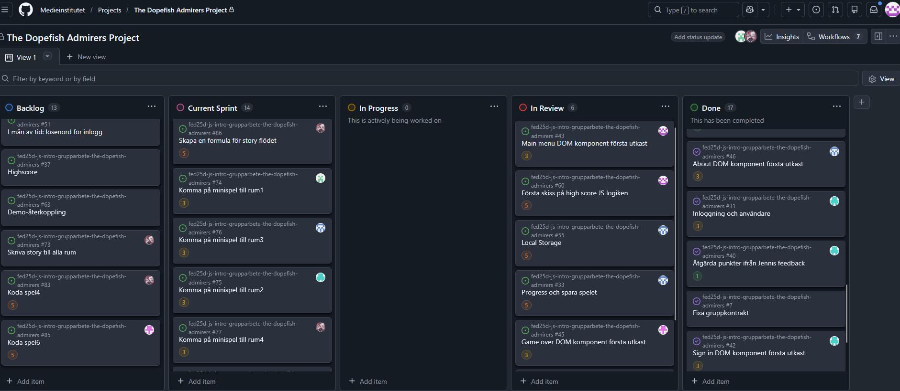

# Daily Standup: Måndag 2026-02-23
Dagens scrum master: Linn Boekhout.

## Alda Catovic
(inte här men uppdaterat oss via teams i förväg med info om nedan)

### Vad gjorde jag i fredags?
Reviewade Rasmus kod med kommentarer samt jobbat med den inre storyn för mitt rum (den inre djungeln).

### Vad ska jag göra idag?
Koda rummet.

### Eventuella hinder?

## Alma Isaksson
### Vad gjorde jag i fredags?
Började skriva på idéstoryn- flödet. Koda en formel till story-flöde när man klickar sig fram i texten.

### Vad ska jag göra idag?
Fortsätta finslipa och jobba på mitt rum. Samt ev kolla hur Alda har tänkt när hon har skrivit storyn till sitt rum.

### Eventuella hinder?
Inte just nu, men skulle vilja veta hur ni andra tänker kring storyn.

## Rasmus Fransson
### Vad gjorde jag i fredags?
Satt med utvecklarmiljön för de olika rummen. 

### Vad ska jag göra idag?
Komma igång med de separata rummen. rum 6.

### Eventuella hinder?
Nej för tillfället.

## Kimi Leminaho
### Vad gjorde jag i fredags?
Reviewade Aldas kod och valde ut ett rum, rum1. 

### Vad ska jag göra idag?
Påbörja rummet.

### Eventuella hinder?
Inte nu.

## Linn Boekhout
### Vad gjorde jag i fredags?
Gjorde klart logiken för highscore-draft1 som ligger uppe för review. Samt spåna ideér för spelet i mitt rum, bestämt memory-spel.

### Vad ska jag göra idag?
Påbörja rummet. Skriva idén för storyn.

### Eventuella hinder?
Nej.

## Isabelle Reynolds
### Vad gjorde jag i fredags?
Jobbade på game-flow flödet, det är klart. 

### Vad ska jag göra idag?
Jobba på det egna rummet. Se till att cheatcode knapparna för utvecklarna fungerar.

### Eventuella hinder?
Nej.

